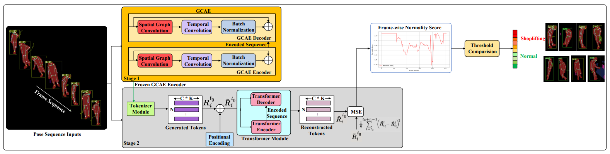

# Shopformer: Transformer-Based Framework for Detecting Shoplifting via Human Pose
## Overview

This repository contains the official implementation of [Shopformer (CVPR 2025)](https://arxiv.org/abs/2504.19970). Shopformer is a novel transformer-based framework designed for detecting shoplifting behaviors using only human pose data, , rather than raw pixel information. Unlike traditional video-based methods, Shopformer focuses on privacy-preserving, pose-based shoplifting detection. The model introduces a two-stage architecture: A Graph Convolutional Autoencoder (GCAE) learns rich spatio-temporal embeddings from human pose sequences. These embeddings are tokenized and passed through a transformer encoder-decoder, which reconstructs the sequence. The reconstruction error is then used to compute a normality score for shoplifting detection.

## Key Features

- GCAE-based tokenization of human pose sequences
- Transformer encoder-decoder with attention for behavior modeling
- Evaluated on PoseLift dataset (real-world shoplifting pose data)
- Privacy-preserving and real-time capable
  
## Shopformer Architecture
The following figure illustrates the overall architecture of the Shopformer model:
<figure>
  
  <figcaption><b>Figure 1:</b> Overview of the Shopformer architecture. The framework operates in two stages: (1) a Graph Convolutional Autoencoder is first trained on pose sequences to learn rich spatio-temporal representations; (2) the pretrained encoder is then repurposed as a tokenizer module, generating compact tokens from input pose data. These tokens are passed through a transformer encoder-decoder module, which reconstructs the input sequence. The reconstruction error (MSE loss) is used to compute the normality score for shoplifting detection.</figcaption>
  </figure>
